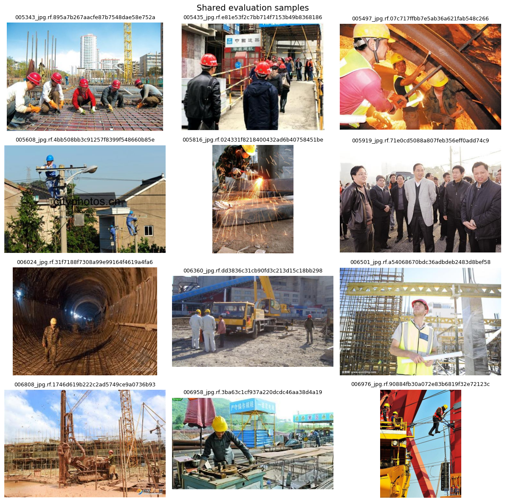
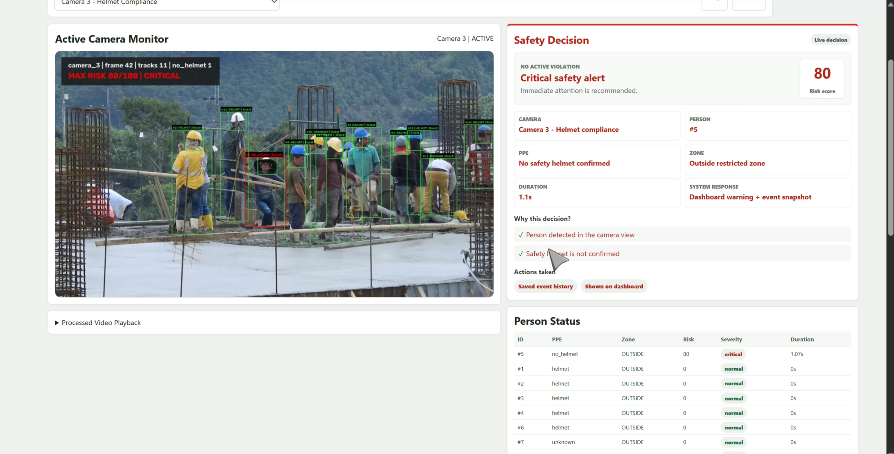

# Factory Safety AI CCTV

Factory Safety AI CCTV là hệ thống demo giám sát an toàn lao động bằng camera và AI thị giác máy tính. Hệ thống nhận video từ các camera trong khu vực công trường/nhà máy, phát hiện người và trạng thái PPE, theo dõi từng người theo thời gian, tính điểm rủi ro theo rule rõ ràng, rồi hiển thị cảnh báo trực tiếp trên dashboard.

Mục tiêu của project không chỉ là “nhận diện có mũ hay không”, mà là dựng một luồng giám sát có thể giải thích được: camera nhìn thấy gì, người nào đang có rủi ro, vì sao hệ thống đưa ra quyết định, mức độ nghiêm trọng là bao nhiêu, và hệ thống đã ghi nhận phản ứng gì.

Dữ liệu dùng để thử nghiệm được lấy từ nhiều bối cảnh công trường và môi trường làm việc khác nhau: ngoài trời, trong nhà xưởng, khu vực thi công, người ở gần/xa camera, góc nhìn cao/thấp và nhiều trạng thái mũ bảo hộ. Các notebook trong `notebooks/` được dùng để chuẩn bị dữ liệu, so sánh model và kiểm tra các mẫu đánh giá trước khi đưa model vào dashboard realtime.



Sau bước thử nghiệm model, dashboard realtime gom toàn bộ pipeline vào một giao diện vận hành: video có overlay, điểm rủi ro, lý do ra quyết định, trạng thái từng người và lịch sử cảnh báo.



Pipeline chính:

```text
Video/CCTV
-> YOLO person + PPE detection
-> person tracking
-> temporal smoothing
-> risk scoring / rule engine
-> stable alert + IoT device simulator
-> FastAPI backend + React realtime dashboard
```

Hệ thống hiện hỗ trợ 3 camera demo:

- `camera_1`: kiểm tra vùng nguy hiểm và PPE/mũ bảo hộ.
- `camera_2`: kiểm tra vùng nguy hiểm.
- `camera_3`: kiểm tra tuân thủ mũ bảo hộ.

## Điểm Nổi Bật

- Dashboard realtime hiển thị camera active, bounding box, trạng thái từng người, điểm rủi ro và lý do ra quyết định.
- Rule engine tách riêng khỏi model AI, giúp dễ chỉnh threshold, dwell time, severity và action theo từng camera.
- Có temporal smoothing và tracking để giảm cảnh báo nhấp nháy theo từng frame.
- Có event history, alert snapshot, log worker và mô phỏng thiết bị IoT như relay/buzzer/light.
- Có CLI runner để chạy demo E2E ngoài dashboard.
- Cấu hình chính nằm trong YAML, hạn chế hardcode trong code.

## Cấu Trúc Thư Mục

```text
factory-safety-ai-cctv/
├── backend/                    # FastAPI backend cho dashboard realtime
│   ├── api/                    # REST endpoints: cameras, events, devices, logs
│   ├── schemas/                # Pydantic/API schemas
│   ├── services/               # Process manager, output reader, websocket payload
│   └── main.py                 # FastAPI app và lifecycle cleanup
│
├── frontend/                   # React + Vite dashboard
│   ├── src/api/                # Axios/API URL helpers
│   ├── src/components/         # Monitor, alert panel, status table, history, device UI
│   └── src/styles/             # CSS layout/dashboard styling
│
├── src/                        # Core AI/CV pipeline
│   ├── configs/                # Config vận hành, camera, zone, risk, runtime
│   ├── demo/                   # CLI E2E runner
│   ├── perception/             # Person detector, PPE detector, detection types
│   ├── safety/                 # Tracking, smoothing, zone check, risk scoring, history
│   ├── iot/                    # IoT/serial-style simulator
│   ├── visualization/          # OpenCV overlay
│   └── utils/                  # Shared utilities
│
├── model/                      # Model weights, không commit file .pt lớn
├── video_source/               # Video demo theo từng camera, không commit file .mp4 lớn
├── outputs/                    # Runtime/generated files
├── notebooks/                  # Notebook thí nghiệm model/dataset
├── scripts/                    # Dev/smoke utilities
├── assets/                     # Hình ảnh dùng trong README
├── docs/                       # Tài liệu phụ
├── requirements.txt            # Python dependencies
└── README.md
```

## Chuẩn Bị Model Và Video

Do model và video có dung lượng lớn, repo không commit trực tiếp các file `.pt` và `.mp4`. Cần đặt file theo cấu trúc sau:

```text
model/
├── person/yolov8s.pt
└── ppe/yolo8s_ppe_best.pt

video_source/
├── camera_1/cam1.mp4
├── camera_2/cam2.mp4
└── camera_3/cam3.mp4
```

## Cách Chạy Dashboard

### 1. Cài Python dependencies

```powershell
cd D:\DAI_HOC\PHONG_VAN\factory-safety-ai-cctv
pip install -r requirements.txt
```

### 2. Chạy backend

```powershell
uvicorn backend.main:app --reload
```

Backend mặc định chạy tại:

```text
http://127.0.0.1:8000
```

Khi backend startup/reset, runtime state trong `outputs/live`, device status, serial log và history sẽ được clear để tránh dashboard đọc lại dữ liệu cũ.

### 3. Chạy frontend

```powershell
cd frontend
npm install
npm run dev
```

Frontend mặc định chạy tại:

```text
http://127.0.0.1:5173
```

Trên dashboard:

1. Chọn camera trong dropdown.
2. Backend tự stop camera cũ và activate camera mới.
3. Bấm `Stop` để dừng camera đang chạy.
4. Bấm `Reset Realtime State` để clear runtime data, log và history.

## Config Quan Trọng

Các thông số nên chỉnh trong `src/configs/`.

| Muốn chỉnh | File |
| --- | --- |
| Video source, camera role, camera nào dùng PPE/zone | `src/configs/video_sources.yaml` |
| Danger zone polygon | `src/configs/camera_zones.yaml` |
| Risk score, severity threshold, dwell time, actions | `src/configs/risk_rules.yaml` |
| Runtime pipeline: FPS/skip, confidence, smoothing, loop video, frame width | `src/configs/runtime_settings.yaml` |
| Policy cho confidence/uncertainty | `src/configs/uncertainty_policy.yaml` |

Ví dụ chỉnh dwell time trong `src/configs/risk_rules.yaml`:

```yaml
dwell_time:
  danger_zone_seconds: 2.0
  no_helmet_seconds: 2.0
```

Ví dụ chỉnh severity:

```yaml
severity_thresholds:
  normal: [0, 24]
  warning: [25, 49]
  high: [50, 79]
  critical: [80, 100]
```

Ví dụ chỉnh runtime trong `src/configs/runtime_settings.yaml`:

```yaml
pipeline:
  inference_every: 2
  live_frame_width: 960
  person_conf: 0.35
  ppe_conf: 0.25
  smoothing_window: 12
  no_helmet_confirm_frames: 6
  risk_alpha: 0.85
  alert_duration_sec: 1.5

dashboard_worker:
  max_frames: 0
  loop_video: true
  save_video: true
  realtime_logs: true
```

Sau khi đổi config, restart camera hoặc restart backend để process mới load lại cấu hình.

## Chạy E2E Demo Bằng CLI

Chạy một camera:

```powershell
python -m src.demo.run_cctv_demo --camera camera_2 --max-frames 300 --save-video
```

Chạy cả 3 camera tuần tự:

```powershell
python -m src.demo.run_cctv_demo --all --max-frames 300 --save-video
```

Chạy loop video giống dashboard:

```powershell
python -m src.demo.run_cctv_demo --camera camera_2 --loop-video --save-video --realtime-logs
```

Output chính:

- `outputs/demo_videos/camera_1_output.mp4`
- `outputs/demo_videos/camera_2_output.mp4`
- `outputs/demo_videos/camera_3_output.mp4`
- `outputs/alert_history.jsonl`
- `outputs/alert_snapshots/*.jpg`
- `outputs/worker_logs/*_worker.log`

## Realtime Architecture

```text
React UI
  ├── MJPEG stream: /api/cameras/{camera_id}/mjpeg
  └── WebSocket metadata: /ws/live

FastAPI backend
  ├── process_manager start/stop camera worker
  ├── output_reader đọc latest frame/event/person status
  └── websocket_manager gửi dashboard payload mỗi giây

Camera worker
  ├── đọc video
  ├── YOLO detection
  ├── tracking + temporal smoothing
  ├── risk scoring/rule engine
  ├── ghi latest jpg/json bằng atomic IO
  └── ghi history/snapshot/device command nếu có event
```

Video stream dùng MJPEG vì đơn giản, dễ debug và phù hợp cho demo CPU. WebSocket chỉ dùng cho metadata realtime như decision trace, trạng thái từng người, alert, device status và serial-style logs.

## Model Và Class Mapping

Person detector:

```text
model/person/yolov8s.pt
COCO class 0 = person
```

PPE detector:

```text
model/ppe/yolo8s_ppe_best.pt
0 = person
1 = helmet
2 = head
```

Lưu ý:

- Không dùng class `person` từ PPE model để check danger zone.
- `head` được hiểu là exposed head / possible no helmet.
- Model hiện chưa được train để phân biệt kỹ `safety_helmet` với `normal_hat`.

## Quyết Định Thiết Kế

- YOLO là tầng nhận thức hình ảnh, không phải nơi ra quyết định cuối cùng.
- Risk scoring và rule engine được tách khỏi detection để dễ kiểm soát, giải thích và mở rộng.
- Tracking và temporal smoothing giúp giảm hiện tượng prediction nhấp nháy.
- Event logging dùng trạng thái ổn định và cooldown, tránh ghi log liên tục theo từng frame.
- Dashboard tập trung vào một camera active tại một thời điểm để demo ổn định và dễ quan sát.

## Debug Nhanh

Nếu camera tự về `IDLE`, kiểm tra worker log:

```powershell
Get-Content outputs\worker_logs\camera_1_worker.log -Tail 80
Get-Content outputs\worker_logs\camera_2_worker.log -Tail 80
Get-Content outputs\worker_logs\camera_3_worker.log -Tail 80
```

Nếu dashboard còn alert/frame cũ, reset runtime:

```powershell
curl -X POST "http://127.0.0.1:8000/api/system/reset-realtime-state?clear_history=true"
```

Nếu muốn chỉnh danger zone:

1. Dùng `scripts/extract_zone_frames.py` hoặc `scripts/smoke_test_zones.py`.
2. Sửa polygon trong `src/configs/camera_zones.yaml`.
3. Restart camera.

## Hạn Chế Hiện Tại

- Demo realtime chạy CPU nên FPS phụ thuộc cấu hình máy.
- AI theo từng frame vẫn có thể dao động khi motion blur, che khuất, người ở xa hoặc góc quay khó.
- PPE model hiện dùng class `helmet` và `head`, chưa phân biệt chắc chắn `safety_helmet`, `normal_hat` và `bare_head`.
- Hệ thống là MVP prototype, chưa phải bản production-ready.

## Hướng Phát Triển

- Mở rộng dataset để phân biệt rõ `safety_helmet`, `normal_hat` và `bare_head`.
- Export model sang ONNX/TensorRT hoặc chạy inference trên GPU để cải thiện FPS.
- Cải thiện multi-camera concurrent nếu cần chạy nhiều camera cùng lúc.
- Dùng WebRTC nếu cần video streaming latency thấp hơn.
- Bổ sung rule/risk config theo yêu cầu thực tế của ban an toàn nhà máy.
